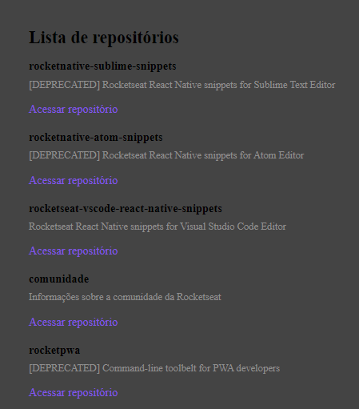

<h1> 
  Github Explorer 
</h1>

  é uma aplicação desenvolvida durante o primeiro capítulo do Ignite-ReactJS da Rocketseat.

 

  

    <kbd>
      
    </kdb>
  

# 🔧 Ferramentas utilizadas 

- [React](https://pt-br.reactjs.org/)
- [TypeScript](https://www.typescriptlang.org/)

 
